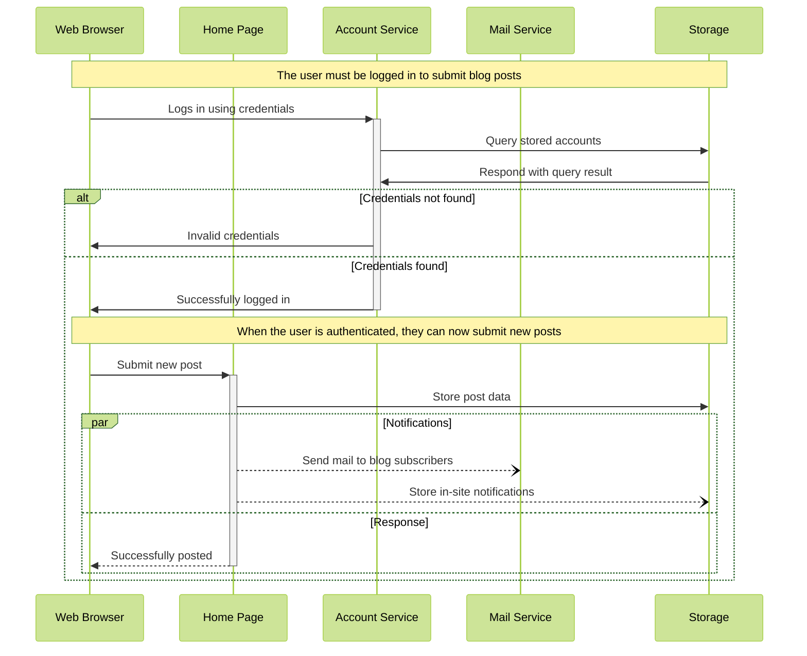

```txt
%%{init:{'theme': 'dark'}}%%
sequenceDiagram;
    participant user as User;
    participant home as Home Page;
    participant login as Login Page;
    participant register as Register Page;
    participant about as About Page;
    participant dashboard as Dashboard Page;
    participant store as Store Service;
    participant api as API(Backend);

    Note over home,about: The user can navigate through the pages without being logged in
    user->>+register: Fills up registration form
    register->>+store: Fills up registration form
    critical Validate User Details
      store->>+api: POST Request to /api/auth/register
      api->>+store: Response
    end
    user-->>+login: Fills up login form
    login-->>+api: User submits login credentials
```

| Tables        |      Are      |  Cool |
| ------------- | :-----------: | ----: |
| col 3 is      | right-aligned | $1600 |
| col 2 is      |   centered    |   $12 |
| zebra stripes |   are neat    |    $1 |



```

```
