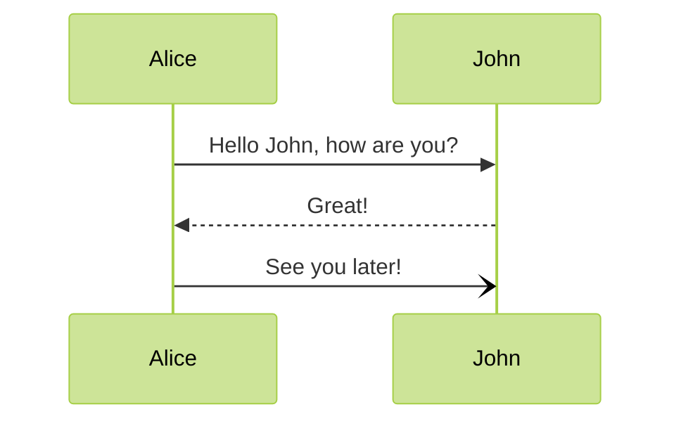

## Chart

- [ ] A `Hero` Section with a dummy image and some text must occupy the right half of the page
- [ ] A Login `Form` must occupy the left half of the page
- [ ] The `Form` has the following input fields `username` and `password`
- [ ] The `Form` has a submit button that dispatches a `submit` event
- [ ] The `submit` event should `fetch` into the `API` with a `POST` method
      and the `username` and `password` as `body` at `/api/auth/login`

      {
        "username" : "super",
        "password" : "user"
      }

## Wireframes

## UI
